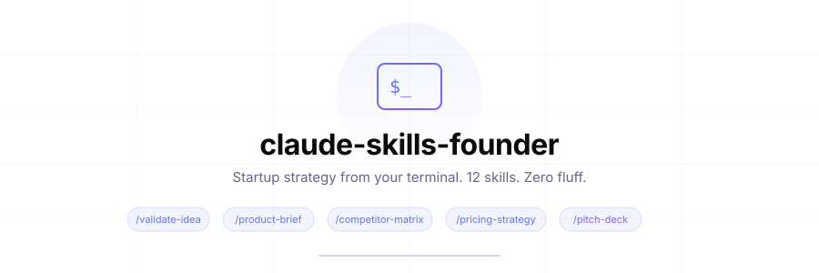

<div align="center">

<picture>
  <source media="(prefers-color-scheme: dark)" srcset="./assets/banner-dark.svg">
  
</picture>

<br />
<br />

**Startup strategy from your terminal. Not another dev tool.**

<br />

<a href="#skills"><strong>Skills</strong></a> ·
<a href="#install"><strong>Install</strong></a> ·
<a href="#usage"><strong>Usage</strong></a> ·
<a href="#examples"><strong>Examples</strong></a> ·
<a href="#philosophy"><strong>Philosophy</strong></a> ·
<a href="#contributing"><strong>Contributing</strong></a>

<br />
<br />

<a href="./LICENSE"></a>
<a href="#skills"></a>
<a href="https://docs.anthropic.com/en/docs/claude-code"></a>
<a href="https://github.com/emotixco/claude-skills-founder/stargazers"></a>

</div>

<br />

> [!NOTE]
> Most Claude Code skill packs are developer tools: code review, git workflows, security audits. **This one is for the founder sitting in a repo at 2am**, trying to figure out if their idea is worth building.

We built these at [Emotix](https://emotix.co?utm_source=github&utm_medium=oss&utm_campaign=claude-skills-founder) while running our own startup. They encode the frameworks, questions, and patterns we wish we had on day one.

<br />

## Skills

<table>
<tr>
<td width="50%">

### Validation and research

| Command | What it does |
|:--------|:------------|
| `/validate-idea` | Stress-test with 7-dimension scorecard |
| `/product-brief` | Structured brief from one sentence |
| `/competitor-matrix` | Feature comparison + positioning gaps |
| `/persona-gen` | 3 personas with priority matrix |
| `/user-interviews` | Mom Test script + analysis framework |

</td>
<td width="50%">

### Strategy and growth

| Command | What it does |
|:--------|:------------|
| `/mvp-scope` | Ruthless feature triage |
| `/pricing-strategy` | Tiers, unit economics, psychology |
| `/go-to-market` | Pre-launch to 90-day growth plan |
| `/landing-page` | Conversion copy, section by section |
| `/email-sequence` | Onboarding emails, ready to send |

</td>
</tr>
<tr>
<td colspan="2">

### Fundraising and metrics

| Command | What it does |
|:--------|:------------|
| `/pitch-deck` | 12-slide outline with per-slide content |
| `/fundraise-prep` | Readiness assessment + investor targeting + 12-week timeline |
| `/metrics-dashboard` | The 5 metrics that actually matter at your stage |

</td>
</tr>
</table>

Every skill takes plain-language input and returns scorecards, tables, and checklists you can act on.

### Skills that build on each other

Each skill saves its output to a `founder/` folder in your project and reads what earlier skills saved. Run `/founder:competitor-matrix` once, and `/founder:pricing-strategy` and `/founder:pitch-deck` reuse its sourced competitor prices instead of starting over.

```
founder/
├── facts.md               # what you told the skills: stage, metrics, team, the raise
├── validate-idea.md
├── competitor-matrix.md
├── pricing-strategy.md
└── ...
```

Commit the folder to keep a history of how your thinking changed, or add it to `.gitignore` to keep it private.

Facts about the outside world, such as competitor prices, funding rounds, market sizes, and benchmarks, come with a source link. When a skill can't find one, it says "Estimate" or "Not found" instead of guessing. Your own metrics, customer quotes, and testimonials are never invented: missing ones show up as `[placeholders]` for you to fill in.

<br />

## Install

<details open>
<summary><strong>Option 1: plugin</strong> (recommended)</summary>

<br />

Inside Claude Code:

```
/plugin marketplace add emotixco/claude-skills-founder
/plugin install founder@emotix
```

Skills become available as `/founder:validate-idea`, `/founder:pricing-strategy`, and so on. Update later with `/plugin marketplace update emotix`. The skill descriptions add about 1,100 tokens to each session. A skill's full instructions load only when you run it.

</details>

<details>
<summary><strong>Option 2: clone</strong> (update with git pull)</summary>

<br />

```bash
git clone https://github.com/emotixco/claude-skills-founder.git ~/.claude/skills/founder
```

Claude Code loads the folder as a plugin on the next session, with the same `/founder:` names. To update:

```bash
git -C ~/.claude/skills/founder pull
```

</details>

<details>
<summary><strong>Upgrading from v1</strong></summary>

<br />

v1 installed flat files into `.claude/commands/founder/`. Delete that folder (or the symlink, if you used the v1 symlink option) before installing v2, or you will see every skill twice. It is either `~/.claude/commands/founder` or `.claude/commands/founder` inside the project where you installed it.

</details>

<br />

## Usage

Open Claude Code and type any skill with your context:

```bash
> /founder:validate-idea An AI tool that analyzes pitch decks and gives investor-perspective feedback
```

```bash
> /founder:competitor-matrix Project management tools for solo founders (not teams)
```

```bash
> /founder:pricing-strategy B2B SaaS for restaurant inventory, targeting independent restaurants with 1-3 locations
```

```bash
> /founder:pitch-deck Pre-seed raise, $500K, AI competitor analysis for founders, 200 beta users, $2K MRR
```

Run a skill with no input and it asks for what it needs.

> [!TIP]
> Be as specific as possible. Include your stage, metrics, constraints, and what you've already tried. Facts you give once are saved to `founder/facts.md`, so you don't have to repeat them.

<br />

## Examples

[`examples/restaurant-inventory/`](./examples/restaurant-inventory/) has unedited output from three skills run in sequence on one idea, including the `founder/` files they wrote. Read it before installing to see what you get.

<br />

## What each skill produces

<details>
<summary><strong>/validate-idea</strong> · the first skill you should run</summary>

<br />

Scores your idea on 7 dimensions (problem severity, market size, willingness to pay, competition gap, distribution, timing, founder fit) and gives a verdict: **build**, **pivot**, or **kill**.

Includes 3 specific validation experiments you can run in under 2 weeks for under $200.

</details>

<details>
<summary><strong>/product-brief</strong> · from idea to structured document</summary>

<br />

Turns a one-sentence idea into a structured brief: problem statement, target audience with personas, value proposition, MVP features (exactly 5-7), success metrics with 90-day targets, risk assessment, and GTM snapshot.

</details>

<details>
<summary><strong>/competitor-matrix</strong> · know your market</summary>

<br />

Researches 5-8 competitors on the web and builds a feature comparison table, with a source link for every price and funding round. Finds positioning gaps no one is filling, ranks threats, and recommends a niche to own.

</details>

<details>
<summary><strong>/persona-gen</strong> · real people, not demographics</summary>

<br />

Creates 3 distinct personas with a day in the life, pain points written the way they would say them, current workarounds, and buying behavior. Includes a priority matrix showing which persona to build for first. Personas are marked as hypotheses until interviews confirm them.

</details>

<details>
<summary><strong>/mvp-scope</strong> · cut ruthlessly</summary>

<br />

Takes your feature wishlist and triages into Must Have / Should Have / Won't Have. Defines the critical user flow (signup to value in under 5 steps), recommends a tech stack, and estimates build time for a solo developer.

</details>

<details>
<summary><strong>/pricing-strategy</strong> · beyond "just charge more"</summary>

<br />

Evaluates 6 pricing models, designs 3 tiers with specific prices and features, checks unit economics, and anchors against competitor prices linked to their pricing pages. Includes anchoring, decoy, and annual framing, plus launch vs. scale pricing and grandfathering.

</details>

<details>
<summary><strong>/go-to-market</strong> · week-by-week launch plan</summary>

<br />

Pre-launch audience building, launch day platform strategy (Product Hunt, HN, Reddit, Twitter/X, LinkedIn), and 90-day post-launch growth with channel prioritization. Budget allocation for $0-$500/month.

</details>

<details>
<summary><strong>/pitch-deck</strong> · investor-ready structure</summary>

<br />

12-slide outline. Every slide gets a headline that states the takeaway, the content, a visual, and speaker notes. Missing numbers become placeholders, collected in a "numbers to find" list at the end. Plus appendix slides for Q&A.

</details>

<details>
<summary><strong>/fundraise-prep</strong> · are you actually ready?</summary>

<br />

Readiness scorecard, round sizing with recommended instrument (SAFE, note, or priced round), investor targeting with a 50-investor pipeline framework, materials checklist, and a 12-week fundraising timeline.

</details>

<details>
<summary><strong>/landing-page</strong> · copy that converts</summary>

<br />

Copy for every section: hero, problem, solution, how it works, social proof, pricing preview, FAQ, and final call to action, plus SEO metadata. Testimonials are left as placeholders that say what a strong quote would cover, because invented ones are false advertising.

</details>

<details>
<summary><strong>/user-interviews</strong> · ask the right questions</summary>

<br />

Interview script that follows The Mom Test: no leading questions, no hypotheticals. Includes screening criteria, problem exploration, solution exploration, and a reaction phase. Analysis framework for synthesizing 5-8 interviews.

</details>

<details>
<summary><strong>/metrics-dashboard</strong> · five metrics, not fifty</summary>

<br />

Defines exactly 5 metrics tailored to your stage (not 15 vanity metrics). Each has a definition, target, and specific action if below target. Weekly review template + investor-ready benchmarks.

</details>

<details>
<summary><strong>/email-sequence</strong> · ready to send</summary>

<br />

5-7 emails for onboarding or re-engagement. Complete copy: subject line with an A/B variant, preview text, a body under 150 words, and one call to action. Timing, segmentation, and targets from published benchmarks included.

</details>

<br />

## Philosophy

<table>
<tr>
<td width="20%" align="center">

**Specific**

"Post a Show HN on Tuesday at 9am ET", not "post on social media"

</td>
<td width="20%" align="center">

**Opinionated**

"Kill this feature", not "consider deprioritizing"

</td>
<td width="20%" align="center">

**Sourced**

Every competitor price and market number links to where it came from

</td>
<td width="20%" align="center">

**Brief**

Every skill has a word limit. Brevity forces clarity.

</td>
<td width="20%" align="center">

**Structured**

Scorecards, matrices, checklists. No walls of text.

</td>
</tr>
</table>

<br />

## Contributing

Have a skill idea? [Open an issue](https://github.com/emotixco/claude-skills-founder/issues) or submit a PR.

**To add a new skill:**

1. Create `skills/<name>/SKILL.md`
2. Add frontmatter with `name`, `description`, `argument-hint`, and `allowed-tools`
3. Add the "Before you start" block every skill uses: which `founder/` files it reads, what it needs, and where it saves
4. Keep the expected output under 2000 words
5. Test it with 3 different inputs: `claude --plugin-dir .`
6. Run `claude plugin validate .` before opening the PR

Rules that apply to every skill, such as sourcing and writing style, live in [`shared/conventions.md`](./shared/conventions.md). Change them there, not in each skill.

> [!IMPORTANT]
> We're looking for skills that fill genuine gaps in the founder workflow, not developer tools repackaged with startup vocabulary.

<br />

## License

[MIT](./LICENSE). Use these however you want.

<br />

---

<div align="center">

<br />

Built by the <a href="https://emotix.co?utm_source=github&utm_medium=oss&utm_campaign=claude-skills-founder">Emotix</a> team

We build AI agents that turn startup ideas into research, analysis, and product briefs.

<br />

<a href="https://emotix.co?utm_source=github&utm_medium=oss&utm_campaign=claude-skills-founder">Website</a> ·
<a href="https://github.com/emotixco">GitHub</a> ·
<a href="https://x.com/emotixco">Twitter</a>

<br />
<br />

</div>
