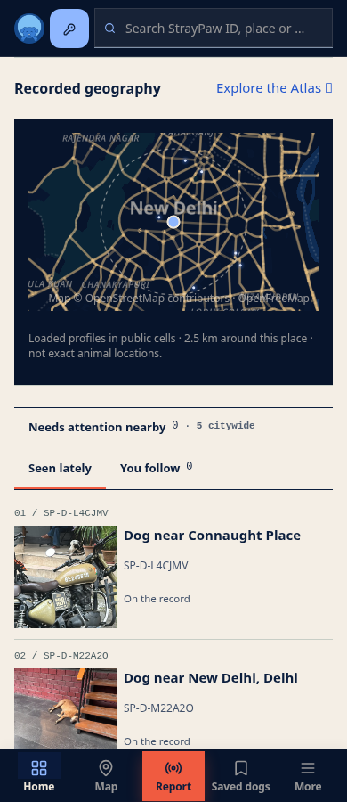
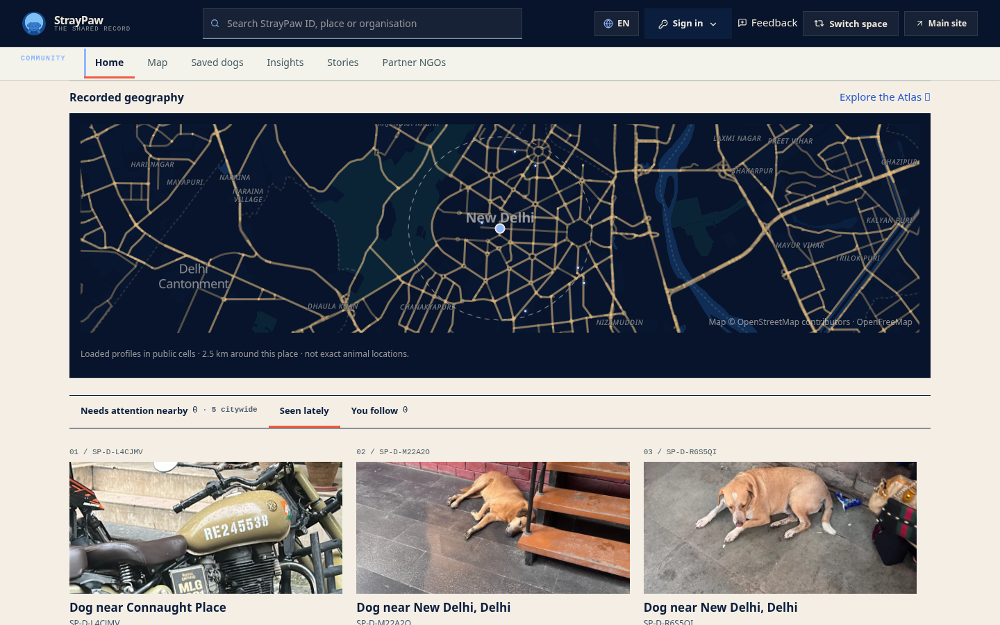
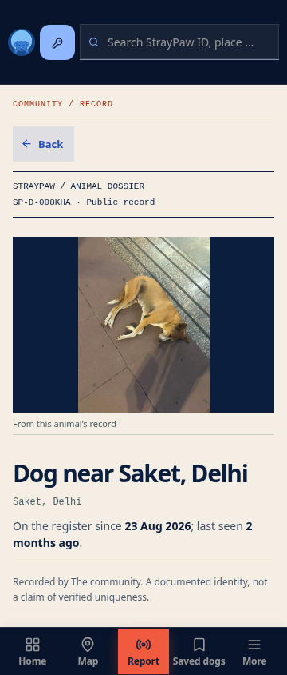
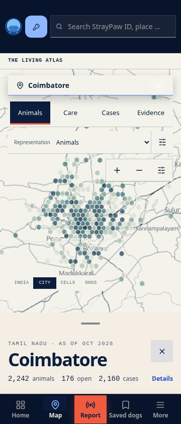

# Compact app: rendered result

Actual production-build browser captures. Home captures use read-only replay
of real public spatial responses; animal and Atlas captures use native reads.
Final hover treatment and removal of the report-button shadow followed captures.

## Community Home

## Phone animal profile and Atlas

[Changes and verification limits](../COMPACT-APP-SHELL.md).
