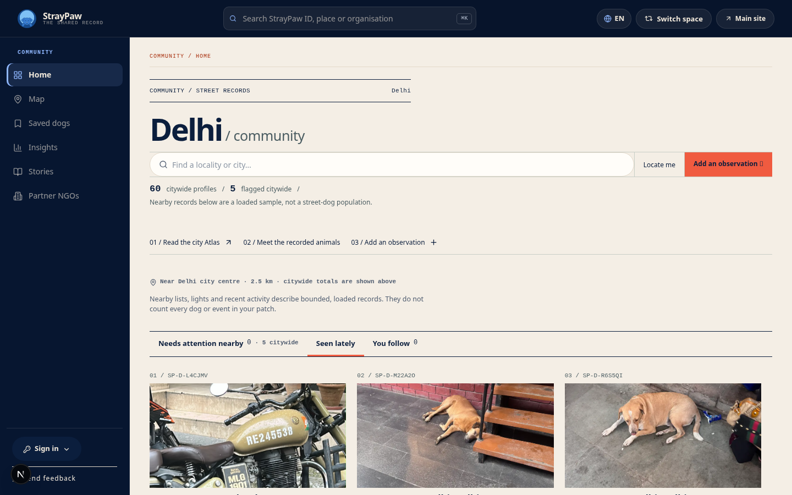
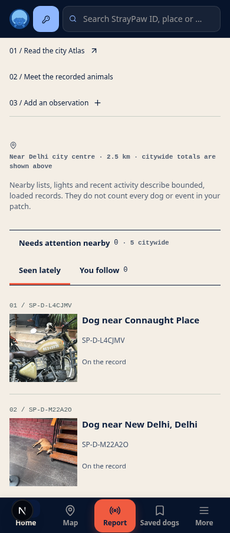
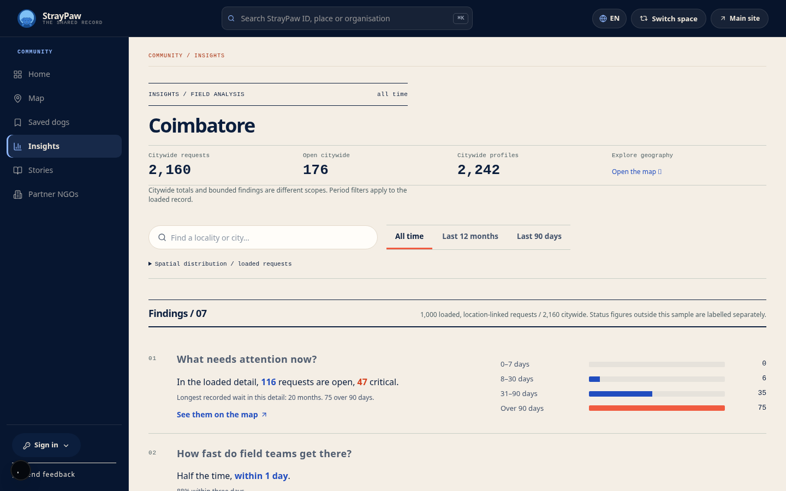
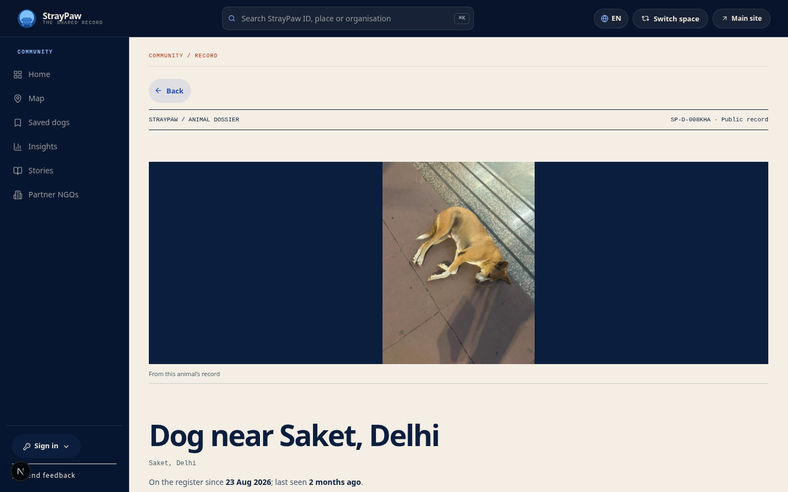
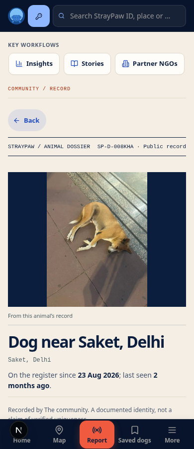
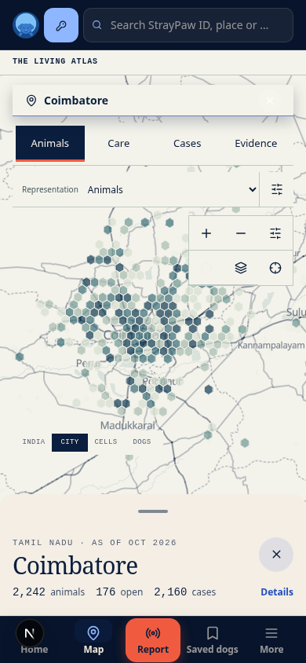
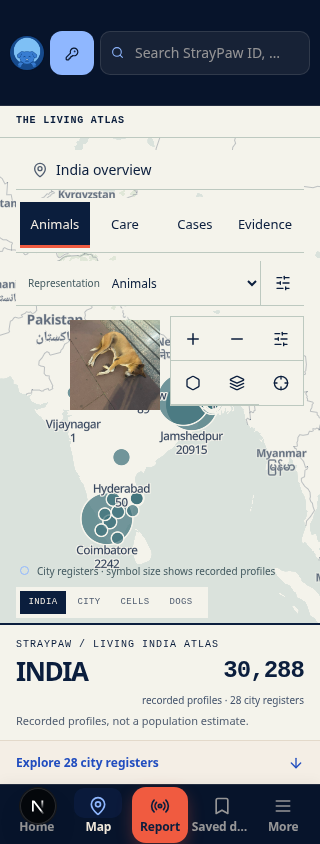

# Implemented street-record OS

Actual local Chromium renders using real public records, not mockups.
These captures precede the final small corrections to rectangular controls,
source-label spacing and compact map explanations.

## Community contact sheet

## Analytical findings register

## Animal dossier

## Geographic surfaces

Verification and remaining work: [implementation handoff](../STREET-RECORD-OS.md).
